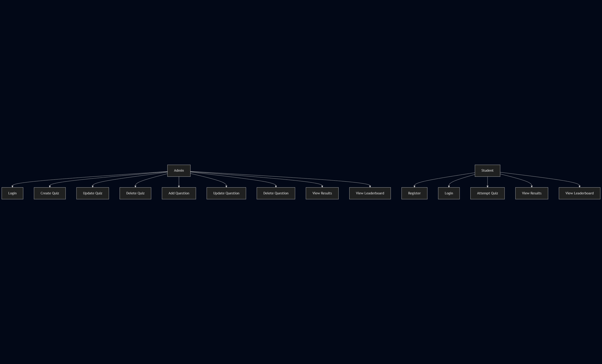
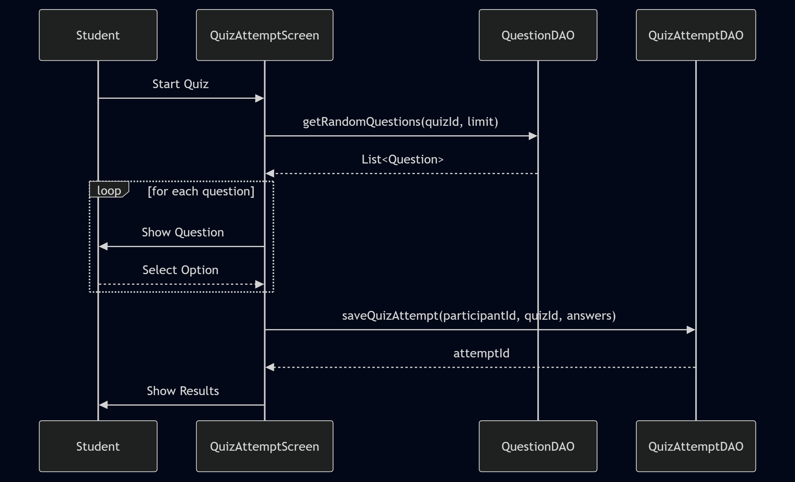
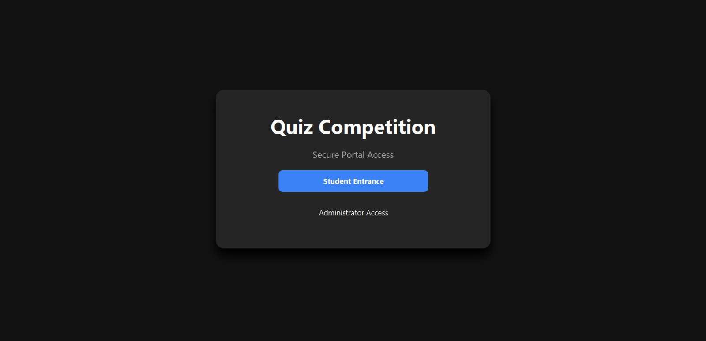
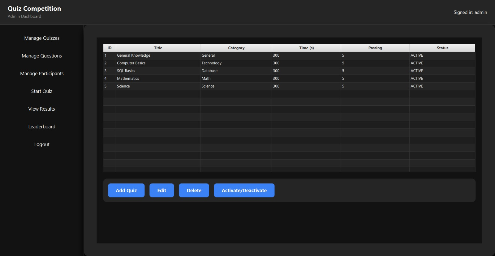
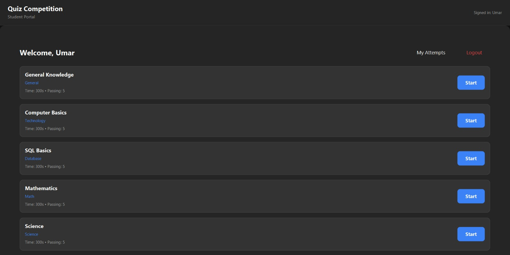
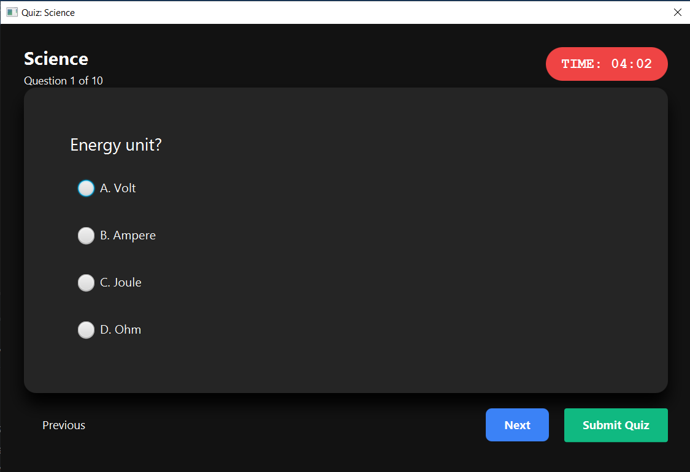
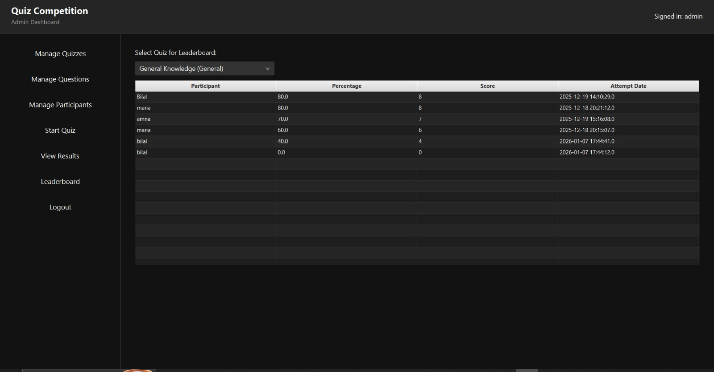

<h1 align="center">🎓 Quiz Competition & Management System</h1>

<b>Object Oriented Programming (CSC241) – Lab Project</b> 
Department of Computer Science 
COMSATS University Islamabad, Abbottabad Campus

---

## 📌 Project Overview

The **Quiz Competition & Management System** is a JavaFX-based desktop application designed to manage quizzes in an academic environment.  
The system enables administrators to create and manage quizzes, while students can register, attempt quizzes, and view results.

This project demonstrates the practical application of **Object-Oriented Programming concepts**, **JavaFX GUI development**, and **database connectivity using JDBC**.

---

## 🚀 Features

### 👨‍🏫 Admin
- Secure admin login  
- Create, update, and delete quizzes  
- Manage quiz questions  
- View student results  
- View leaderboard  

### 👨‍🎓 Student
- Student registration and login  
- View available quizzes  
- Attempt timed quizzes  
- Automatic score calculation  
- View quiz results and leaderboard  

---

## 🛠️ Technologies Used

| Technology | Description |
|-----------|------------|
| Java (JDK 8+) | Core programming language |
| JavaFX | Graphical User Interface |
| MySQL | Database |
| JDBC | Database connectivity |
| Git & GitHub | Version control |

---

## 🗂️ Project Structure

src/main/java/com/quiz

├── MainApp.java

├── AppNavigator.java

│

├── model

│ ├── Admin.java

│ ├── Participant.java

│ ├── Quiz.java

│ ├── Question.java

│ ├── QuizAttempt.java

│ └── AttemptAnswer.java

│

├── dao

│ ├── DBConnection.java

│ ├── AdminDAO.java

│ ├── ParticipantDAO.java

│ ├── QuizDAO.java

│ ├── QuestionDAO.java

│ └── QuizAttemptDAO.java

│

└── ui

├── UIUtil.java

├── WelcomeScreen.java

├── LoginScreen.java

├── StudentLoginScreen.java

├── DashboardScreen.java

├── StudentDashboard.java

├── QuizAttemptScreen.java

---

## 📐 UML Diagrams

All UML diagrams are available in the `/uml` directory.

### Class Diagram

### Use Case Diagram

### Sequence Diagram

---
## 🖼 Screenshots

### Welcome Screen

### Admin Dashboard

### Student Dashboard

### Quiz Attempt

### Results / Leaderboard

---

## 📄 Documentation

### 🎯 Objectives
- Automate quiz management and evaluation  
- Reduce manual result calculation  
- Demonstrate OOP principles in Java  

### 📦 Scope
- Desktop-based Java application  
- Admin and Student roles  
- MySQL database integration  

### ⚠ Limitations
- Passwords are stored in plain text  
- Desktop-only application  
- Limited scalability  

---

## 🧾 Installation & Setup 

### Prerequisites
- Java JDK 8 or higher  
- MySQL Server  
- IntelliJ IDEA or Eclipse  
- Git  

### Setup Steps 

1. Clone the repository:
git clone https://github.com/Bilal-69-J/Quiz-Management-System.git

2. Create a MySQL database and import the SQL file.

3. Configure database credentials in db.properties.

4. Run MainApp.java from your IDE.

----

## 🔄 Git & GitHub Usage

This project uses Git and GitHub for version control.
Public GitHub repository
Frequent commits with descriptive messages
UML diagrams and documentation included

## 👨‍💻 Contributor

Bilal — UI & lead developer

Umar — Database design

Maria — DAO & documentation

---

## 📄 License
This project is developed for academic purposes as part of the
CSC241 Object Oriented Programming Lab.

